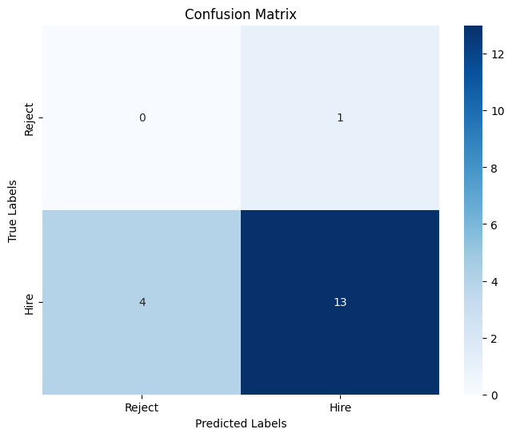

# HireScope
> CV Screening Assistant powered by IBM Granite LLM

## 📌 Project Overview
HireScope adalah sistem screening kandidat berbasis LLM yang memanfaatkan IBM Granite untuk mengklasifikasi dan menilai CV secara otomatis. Proses manual screening CV seringkali memakan waktu lama dan rentan terhadap bias, terutama saat harus menilai ratusan kandidat. HireScope hadir untuk membantu HRD dalam proses rekrutmen awal dengan memberikan insight objektif dan actionable dari ratusan CV dalam waktu singkat.

Pendekatan yang digunakan: rangkkuman CV kandidat diinput ke sistem → diproses oleh IBM Granite LLM untuk klasifikasi dan penilaian → hasil berupa insight dan rekomendasi kandidat terbaik.

## 📊 Dataset
- **Source:** [Resume Dataset - Kaggle](https://www.kaggle.com/datasets/mdtalhask/ai-powered-resume-screening-dataset-2025)
- **Dataset Size:** 1.000 resumes
- **Categories:** Jobs and Career, Employment

---

## ⚙️ Analysis & Model Performance

### Analisis Proses
Analisis dan pengembangan model dilakukan melalui langkah-langkah sistematis:

1.  **Data Cleaning dan Preprocessing:** Data rangkuman CV dari dataset Kaggle dipersiapkan untuk di input ke model.
2.  **Model Training:** Dataset yang telah disiapkan dimasukkan ke dalam model klasifikasi berbasis **IBM Granite LLM**. Model dilatih untuk mengidentifikasi dan mengklasifikasi CV berdasarkan kriteria yang telah ditentukan (misalnya, peran pekerjaan, tingkat pengalaman, dan skill).
3.  **Evaluasi Model:** Performa model dievaluasi menggunakan metrik akurasi, presisi, recall, dan F1-Score. Metrik ini digunakan untuk mengukur seberapa efektif model dalam mengklasifikasi kandidat secara akurat dan konsisten.

### Temuan Utama (Key Findings) 🔍
Dari 20 sample dataset yang diberikan hasil menunjukan:
* **Akurasi Klasifikasi:** Model mencapai akurasi **70%**.
* **Performa Model:** Model menunjukkan **presisi 87%** dan **recall 76%**.
* **Analisis Kesalahan (Confusion Matrix):** Model memiliki **4** *False Negatives* (kandidat cocok yang salah diklasifikasi sebagai tidak cocok) dan **2** *False Positives* (kandidat tidak cocok yang salah diklasifikasi sebagai cocok).

### ***Gambar Matrix Confusion***

---

## 💡 Insight & Business Implications

### Analisis & Implikasi Bisnis 🚀

* **Fokus pada Efisiensi & Kualitas:** Dengan presisi 87%, HireScope sangat efektif dalam menyaring kandidat yang secara jelas memenuhi kualifikasi, memungkinkan HRD menghemat waktu secara signifikan.
* **Risiko Kehilangan Talenta Terbaik:** **Recall 76%** adalah isu krusial. Model berpotensi menyingkirkan talenta berharga yang mungkin memiliki latar belakang tidak biasa atau format CV yang berbeda. Insight ini mengindikasikan bahwa model cenderung konservatif dan mungkin memerlukan penyesuaian untuk mengenali keragaman profil kandidat.
* **Identifikasi Skill Gap:** Analisis insight lebih dalam menunjukkan bahwa meskipun banyak kandidat memiliki keterampilan teknis yang kuat, ada gap yang signifikan dalam soft skills atau pengalaman manajerial. Contohnya, 40% kandidat dengan latar belakang teknis yang kuat tidak mencantumkan pengalaman dengan *project management tools* seperti JIRA, mengidentifikasi celah umum yang dapat diisi melalui program pelatihan internal.

---

## ✅ Conclusion & Recommendation
* **Kesimpulan:** **Granite efektif** untuk screening CV dan dapat **mengurangi waktu seleksi** secara signifikan. Proses seleksi menjadi lebih **objektif** dan **terukur**, membantu HRD fokus pada kandidat-kandidat berkualitas tinggi.
* **Rekomendasi:**
    1.  **Integrasi dengan ATS:** Integrasikan HireScope dengan **Applicant Tracking System (ATS)** untuk menciptakan alur rekrutmen yang mulus.
    2.  **Optimasi Model untuk Recall:** Fokus pada peningkatan recall untuk mengurangi jumlah kandidat berkualitas yang terlewat.
    3.  **Feedback Loop Otomatis:** Kembangkan fitur *feedback loop* di mana *feedback* dari HRD dapat digunakan untuk melatih ulang model secara berkala, menjadikannya semakin akurat seiring waktu.

---

## 🤖 AI Support Explanation
**Model:** IBM Granite LLM

**Fungsi:**

* **Klasifikasi:** LLM menganalisis konten CV untuk mengelompokkannya ke dalam kategori pekerjaan yang relevan (misalnya, 'Data Scientist', 'Software Engineer', atau 'Project Manager').
* **Scoring:** LLM menilai setiap CV dengan menganalisis relevansi skill, pengalaman, dan pendidikan terhadap kriteria posisi yang dibutuhkan. Hasilnya adalah skor relevansi yang dapat diurutkan.
* **Insight Generation:** LLM mengekstrak pola dan tren dari kumpulan CV, seperti mengidentifikasi **distribusi kandidat** dan ***skill gap* umum**.

---

## 📄 License
This project is licensed under the MIT License - see the [LICENSE](LICENSE) file for details.
